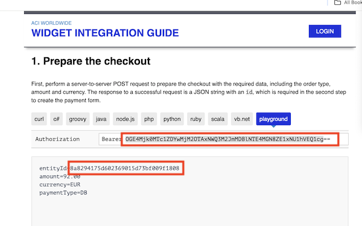

## Introduction

The Postman Collection enables a [ACI COPYandPAY](https://docs.aciworldwide.com/integrations/widget) Payment Form to be used to take card payments through OPF. 

The integration supports:

* Authorization of card payments using ACI COPYandPay using the OPF "iFrame" UX pattern
* Deferred Capture 
* Refunds
* Reversal

## Known Issues
* The integration has only been tested by the public available playground credentials found on the [COPYandPAY Playground](https://docs.aciworldwide.com/integrations/widget).

## Planned Backlog Items
* Webhook Notifications
* Recurrent Authorization

## Setup Instructions

### Overview
To import the [ACI Hosted Page Postman Collection](mapping_configuration.json), this page will take you through the following steps:

a) Get the credentials needed to integrate with the Sandbox
b) Prepare the [Postman Environment](environment_configuration.json) file so the collection can be imported with all your OPF tenant and sandbox values. 

### Creating Payment Integration
Create a new payment integration in the OPF Workbench and set the Merchant ID. For reference, see [Creating Payment Integration](https://help.sap.com/docs/SAP_COMMERCE_CLOUD_PUBLIC_CLOUD/0996ba68e5794b8ab51db8d25d4c9f8a/20a64f954df1425391757759011e7e6b.html?state=DRAFT).

You can use the Entity ID value as the Merchant ID from the [Code examples](https://docs.aciworldwide.com/integrations/widget).
The API token is also present in the sandbox.

### Preparing the Postman environment_configuration file

**1. Token**

Get your access token using the auth endpoint https://{{authendpoint}}/oauth2/token and client ID and secret obtained from BTP Cockpit.

Copy the value of the access_token field (it’s a JWT) and set as the ``token`` value in the environment file.

**IMPORTANT**: Ensure the value is prefixed with **Bearer**. e.g. ``Bearer {{token}}``.

**2. Root url**

The ``rootUrl`` is the **BASE URL** of your OPF tenant.

E.g. if your workbench/OPF cockpit url was this …

<https://opf-iss-d0.uis.commerce.stage.context.cloud.sap/opf-workbench>.

The base Url would be

https://opf-iss-d0.uis.commerce.stage.context.cloud.sap.

**3. Integration and Configuration**

The ``integrationId`` and ``configurationId`` values identify the payment integration, which can be found in the top left of your **Configuration Details** page in the OPF workbench.

**4. API Credentials**

Use the Bearer value from the Play ground as the ``apiToken``.

**5. API Domain**

The ``apiDomain`` can be either ``eu-test.oppwa.com`` for EUR transactions or ``test.oppwa.com`` for USD.

### Allowlist
Depending on your environment, add the following domains to the domain allowlist in OPF workbench. For instructions, see [Adding Tenant-specific Domain to Allowlist
](https://help.sap.com/docs/SAP_COMMERCE_CLOUD_PUBLIC_CLOUD/0996ba68e5794b8ab51db8d25d4c9f8a/a6836485b4494cfaad4033b4ee7a9c64.html?state=DRAFT).

``eu-test.oppwa.com``
``test.oppwa.com``
``oppwa.com``

### Summary

The envirionment file is now ready for importing into Postman together with the Mapping Configuration Collection file. Ensure you select the correct environment before running the collection.

In summary, you should have edited the following variables: 

#### Common
- ``token``
- ``rootUrl``
- ``integrationId``
- ``configurationId``

#### ACI Specific
- ``apiToken``
  
For sandbox testing, all other values can be left as defaults.  
