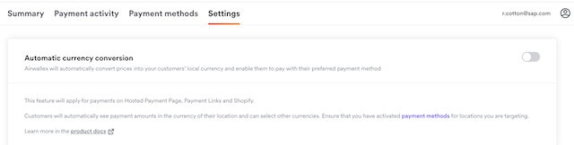
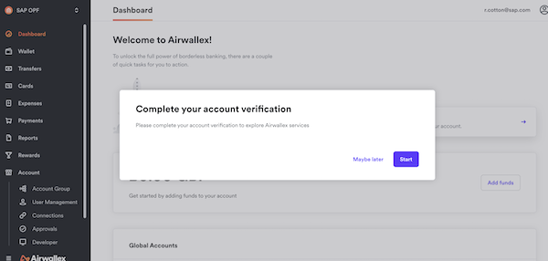
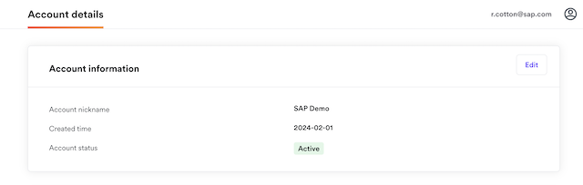
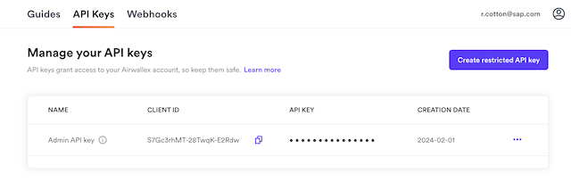
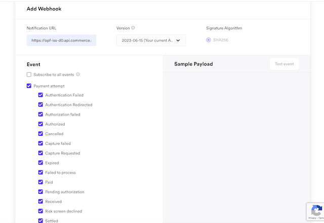
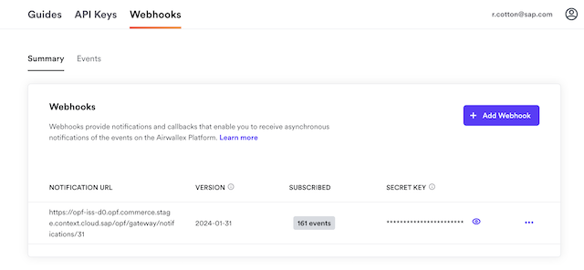

## Introduction

The Postman Collection enables a [Airwallex Hosted Page](https://developer.paypal.com/braintree/docs/start/hosted-fields) Payment Form to be used to Take Payments through OPF. 

The integration supports:

* Authorization of Card Payments using PCI SAQ-A Airwallex Hosted Page using the OPF "Payment Page" UX Pattern
* Deferred Capture 
* Refunds
* Reversal

## Known Issues
* Auto currency conversion should be disabled under the Account -> Payment -> [Settings](https://demo.airwallex.com/app/acquiring/settings) menu
  

Dynamic pay-in currencies are currently not supported by OPF. Please contact SAP if this feature is required for production use.

## Planned Backlog Items
* Notification Authentication
* Recurrent Authorization

## Setup Instructions

### Overview
To import the [Aiwallex Hosted Page Postman Collection](mapping_configuration.json) this page will take you through the following steps

a) Sign up for a Airwallex Demo Account

b) Complete onboarding the activate the Airwallex accoubnt

c) Create a Merchant Account Group in OPF Workbench.

d) Set up Your Airwallex Sandbox Account to work with OPF.

e) Prepare the [Postman Environment](environment_configuration.json) file so the collection can be imported with all your OPF Tenant and Airwallex Demo Account unique values. 

### Create a Airwallex Account
You can sign up for a free Airwallex Demo Account at https://demo.airwallex.com/signup.

Before you can proceed Aiwallex requires an onboarding pricess to be completed that involves account verification.

To create a test account without completeting the company onboarding you will need to contact Airwallex support.

It will not be possible to proceed otherwise.

### Creating the Merchant Account Group
Create a new Account Group in the OPF Workbench and set the Merchant ID.

You can use the Account Nickname value as the Merchant ID from the [Account menu](https://demo.airwallex.com/app/account/details) 

### Preparing the Postman environment_configuration file

**1. Token**

Get your access token using the auth endpoint https://{{authendpoint}}/oauth2/token and client ID and secret obtained from BTP Cockpit.

Copy the value of the access_token field (it’s a JWT) and set as the ``token`` value in the environment file.

IMPORTANT: Ensure the value is prefixed with **Bearer**. e.g. ``Bearer {{token}}``.

**2. Root url**

The ``rootUrl`` is the **BASE URL** of your OPF tenant.

E.g. if your workbench/OPF cockpit url was this …

<https://opf-iss-d0.uis.commerce.stage.context.cloud.sap/opf-workbench>.

The base Url would be

https://opf-iss-d0.uis.commerce.stage.context.cloud.sap.

**3. Account and Account Group**

The ``accountId`` and ``accountGroupId`` values identify the merchant account group can be found in the top left of your merchant configuration.

**4. API Credentials**

The ``clientId`` and ``apiKey`` values can  be found from the [Api Keys](https://demo.airwallex.com/app/account/apiKeys) menu found under Developer.

You can use the Admin key for demo/sandbox testing, but restricted keys are recommended for production.

**5. Webhook Secret**

IN OPF Workbench: For your new Airwallex merchant account Navigate to **Notification General** and copy the Notification URL.

In the Airwallex dashboard you need to navigate to Account -> Developer -> [Webhooks](https://demo.airwallex.com/app/developer/webhooks) and add a Webhook endpoint. 

i) Paste in your endpoint URL copied from OPF.

ii) Check **All Payment . Payment Attempt events**.

ii) Save and View the secret key and set that as the ``webhookSecret`` variable

### Allowlist
Add the following domains to the domain allowlist in OPF workbench. For instructions, see [Adding Tenant-specific Domain to Allowlist
](https://help.sap.com/docs/SAP_COMMERCE_CLOUD_PUBLIC_CLOUD/0996ba68e5794b8ab51db8d25d4c9f8a/a6836485b4494cfaad4033b4ee7a9c64.html?state=DRAFT).

``airwallex.com``

### Summary

The envirionment file is now ready for importing into Postman together with the Mapping Configuration Collection file. Ensure you select the correct environment before running the collection.

In summary, you should have edited the following variables: 

#### Common
- ``token``
- ``rootUrl``
- ``accountGroupId``
- ``accountId``

#### Airwallex Specific
- ``clientId``
- ``apiKey``
- ``webhookSecret``
  
For sandbox testing, all other values can be left as defaults.  

### Airwallex Setup
More documentation regarding setup of settlement currencies and payment methods can be found [here](https://www.airwallex.com/docs/payments__get-started-with-payments__set-up-your-merchant-account). Ensure at least one payment method is activated.
