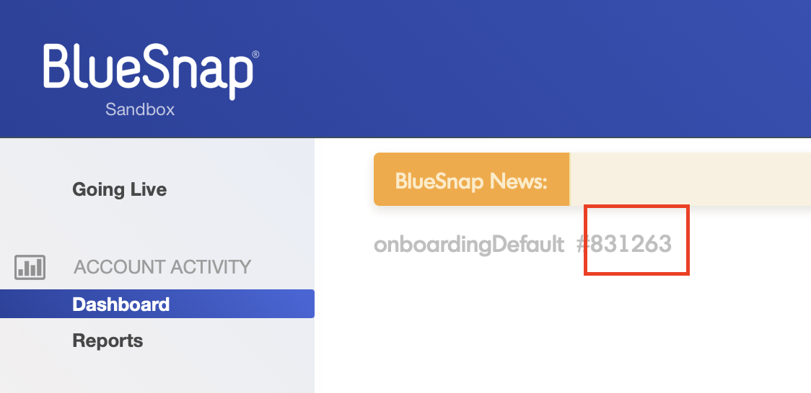
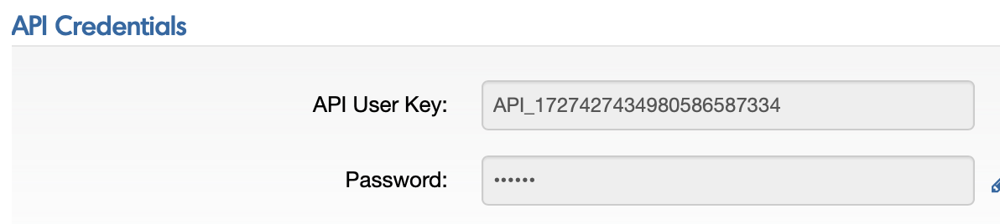

## Introduction ##
This Postman Collection aids in integrating [BlueSnap](https://support.bluesnap.com) into the Open Payment Framework (OPF).

The integration supports:

* Authorize card using Hosted Page
* Settlement - Auto Capture Pattern
* Refund
* Reauthorization

### In summary ###
In summary, to import the [Postman Collection](mapping_configuration.json), this page will guide you through the following steps:

a) [Create your BlueSnap test account](https://sandbox.bluesnap.com/jsp/onboarding/index.jsp).

b) Create a BlueSnap payment integration in OPF

c) Get the credentials of your BlueSnap integration.

d) Prepare the [Postman Environment](environment_configuration.json) file so the collection can be imported with all your OPF Tenant and BlueSnap Test Account unique values. 

### Creating a BlueSnap Account ###
You can sign up for a free BlueSnap test account at [Create your BlueSnap test account](https://sandbox.bluesnap.com/jsp/onboarding/index.jsp).

### Creating a BlueSnap Payment Integration ###
Create a BlueSnap payment integration in the OPF workbench. For reference, see [Creating Payment Integration
](https://help.sap.com/docs/SAP_COMMERCE_CLOUD_PUBLIC_CLOUD/0996ba68e5794b8ab51db8d25d4c9f8a/20a64f954df1425391757759011e7e6b.html?state=DRAFT).

The Merchant ID is the customer id found in the header of BlueSnap Backoffice

### Setting up Your BlueSnap Test Account to work with OPF ###
Once you have created you Saferpay test account, do the following to set it up to work with OPF:
1. Create a [JSON API Basic Authentication Login](https://developers.bluesnap.com/reference/api-credentials) Follow the steps to get your API credentials.

   

### Preparing the Postman environment_configuration file ###

**1. Token**

Get your access token using the auth endpoint https://{{authendpoint}}/oauth2/token and client ID and secret obtained from BTP Cockpit.

Copy the value of the access_token field (it’s a JWT) and set as the ``token`` value in the environment file.

**IMPORTANT**: Ensure the value is prefixed with **Bearer**. e.g. ``Bearer {{token}}``.

**2. Root url**

The ``rootUrl`` is the **BASE URL** of your OPF tenant.

E.g. if your workbench/OPF cockpit url was this …

<https://opf-iss-d0.uis.commerce.stage.context.cloud.sap/opf-workbench>.

The base Url would be

https://opf-iss-d0.uis.commerce.stage.context.cloud.sap.

**3. Integration ID and Configuration ID**

The ``integrationId`` and ``configurationId`` values identify the payment integration, which can be found in the top left of your **Configuration Details** page in the OPF workbench.

* ``integrationId`` maps to ``accountGroupId`` in postman
* ``configurationId`` maps to ``accountId`` in postman

**4. authentication_outbound_basic_auth_username_export_214**

The value of this Variable is the JSON API Username, this usually starts with ``API_`` in BlueSnap.

**5. authentication_outbound_basic_auth_password_export_214**

This is the password you set for the corresponding JSon API User.

**6. payApiEnv**

Add the BlueSnap Javascript to your site. BlueSnap provides a Javascript file for both the sandbox and production environments. Below are the script elements for each environment:

``pay.bluesnap.com`` for production script element

``sandpay.bluesnap.com`` for test script element

### Allowlist
Add the following domains to the domain allowlist in OPF workbench. For instructions, see [Adding Tenant-specific Domain to Allowlist
](https://help.sap.com/docs/SAP_COMMERCE_CLOUD_PUBLIC_CLOUD/0996ba68e5794b8ab51db8d25d4c9f8a/a6836485b4494cfaad4033b4ee7a9c64.html?state=DRAFT).

``ws.bluesnap.com`` for production account

``sandbox.bluesnap.com`` for test account

### Summary

The envirionment file is now ready for importing into Postman together with the Mapping Configuration Collection file. Ensure you select the correct environment before running the collection.

In summary, you should have edited the following variables: 

#### Common
- ``token``
- ``rootUrl``
- ``accountGroupId``
- ``accountId`` 

#### BlueSnap Specific
- ``authentication_outbound_basic_auth_username_export_214``
- ``authentication_outbound_basic_auth_password_export_214``
- ``merchantId``
  
