## Introduction

The Postman Collection enables a [Braintree Hosted Fields](https://developer.paypal.com/braintree/docs/start/hosted-fields) Payment Form to be used to take payments through OPF. 

The integration supports:

* Authorization of Card Payments using PCI SAQ-A Braintree Hosted Fields using the OPF "Hosted Fields" UX pattern
* Deferred Capture (Single Capture per Order)
* Refunds
* Reversal
* Recurrent Authorization
* Paypal support

## Known Issues
* Card refunds will fail if initiated before they are sent to Settlement.
* Workaround manual process of refunding in Braintree based on failed transactions in OPF, then manual update of stuck OPF transaction.

## Planned Backlog Items
* Applepay / Googlepay Support

## Setup Instructions

### Overview
To import the [Braintree Hosted Field Postman Collection](mapping_configuration.json) this page will take you through the following steps

a) Sign up for a Braintree Sandbox Account
b) Create a payment integration in OPF workbench.
c) Set up your Brasintree Sandbox Account to work with OPF.
d) Prepare the [Postman Environment](environment_configuration.json) file so the collection can be imported with all your OPF Tenant and Braintree Sandbox Account unique values. 

### Create a Braintree Account
You can sign up for a free Braintree Sandbox Account at https://www.braintreepayments.com/sandbox

### Creating Payment Integration
Create a new payment integration in the OPF workbench and set the Merchant ID. For reference, see [Creating Payment Integration](https://help.sap.com/docs/SAP_COMMERCE_CLOUD_PUBLIC_CLOUD/0996ba68e5794b8ab51db8d25d4c9f8a/20a64f954df1425391757759011e7e6b.html?state=DRAFT).

The Merchant ID can be found in the Settings -> Business Area of the Braintree Admin UI
 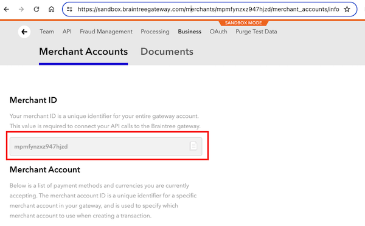

### Setting up Sub-Merchants for each Currency
Braintree requires a separate merchant account to be created for each Currency.

This configuration is setup out of the box to accept multiple currencies if sub-merchant accounts are created with a the name convention on ``sap-<currency-iso3-lowercase>`` e.g. ``sap-gbp``. If desired you can use a different prefix to ``sap-`` by changing the value of the OPF variable ``merchantAccountIdPrefix``. If you do this, remember to change the default value in the environment file later.

The merchant configuration is found under Settings->Business Area of the Braintree Admin UI.

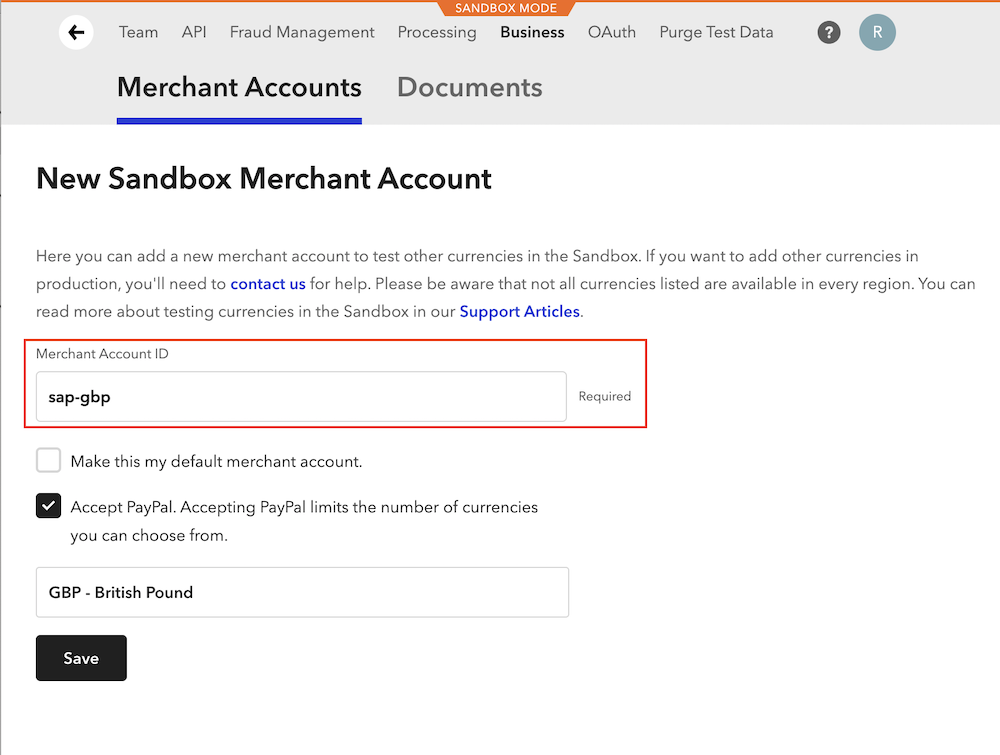 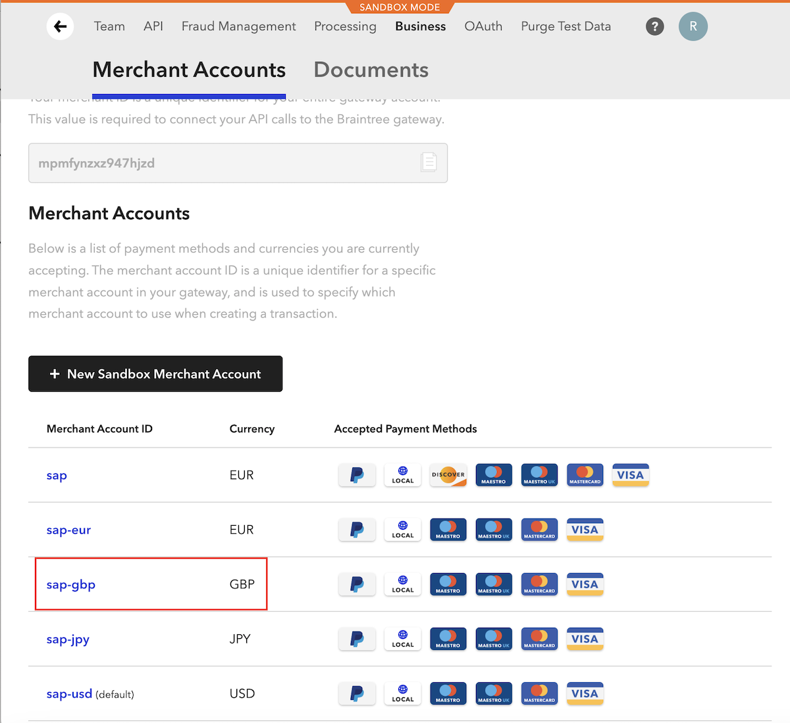

### Preparing the Postman environment_configuration file

**1. Token**

Get your access token using the auth endpoint https://{{authendpoint}}/oauth2/token and client ID and secret obtained from BTP Cockpit.

Copy the value of the access_token field (it’s a JWT) and set as the ``token`` value in the environment file.

IMPORTANT: Ensure the value is prefixed with **Bearer**. e.g. ``Bearer {{token}}``.

**2. Root url**

The ``rootUrl`` is the **BASE URL** of your OPF tenant.

E.g. if your workbench/OPF cockpit url was this …

<https://opf-iss-d0.uis.commerce.stage.context.cloud.sap/opf-workbench>.

The base Url would be

https://opf-iss-d0.uis.commerce.stage.context.cloud.sap.

**3. Account and Account Group**

The ``accountId`` and ``accountGroupId`` values identify the merchant account group can be found in the top left of your merchant configuration.

**4. API Credentials**

The Public and Private key can be obtained in the Settings -> API -> Keys section of the Braintree Dashboard

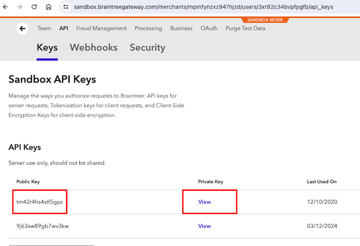

* Set the public key **value** for environment variable ``authentication_outbound_basic_auth_username_export_51``
* Set the private key **value** for environment variable ``authentication_outbound_basic_auth_password_export_51``

**5. Merchant Account ID Prefix**
Optionally, you can change the merchant account id prefix by setting the variable ``merchantAccountIdPrefix``.

### Allowlist
Add the following domains to the domain allowlist in OPF workbench. For instructions, see [Adding Tenant-specific Domain to Allowlist
](https://help.sap.com/docs/SAP_COMMERCE_CLOUD_PUBLIC_CLOUD/0996ba68e5794b8ab51db8d25d4c9f8a/a6836485b4494cfaad4033b4ee7a9c64.html?state=DRAFT).

``braintree-api.com``

### Summary

The envirionment file is now ready for importing into Postman together with the Mapping Configuration Collection file. Ensure you select the correct environment before running the collection.

In summary, you should have edited the following variables: 

#### Common
- ``token``
- ``rootUrl``
- ``accountGroupId``
- ``accountId``

#### Braintree Specific
API Key Configuration
- ``authentication_outbound_basic_auth_username_export_51``
- ``authentication_outbound_basic_auth_password_export_51``

- ``merchantAccountIdPrefix`` (optional)

For sandbox testing, all other values can be left as defaults.  

## Setup PayPal
The integration supports adding PayPal as an additional payment method to cards.

### OPF Setup
To enable PayPal OPF side, you will add a APM and describe to OPF how PayPal payments should be handled.

Create a New APM for PayPal in the Alternative Payment Method Tab in OPF Workbench
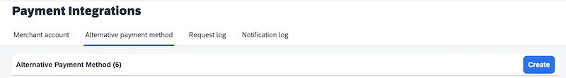

On the APM Creation Screen:
- Set the name as ``PayPal``
- Set the code as ``paypal``
- Set the APM Type to ``Direct``
- Paypal allows multiple captures, so set the settlement pattern to ``Partial Capture per Shipment``
- Toggle on ``Refund`` and ``Reauthorization`` are supported

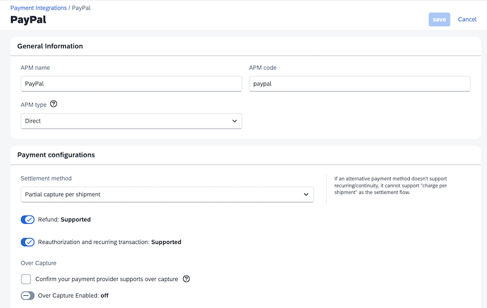

Assign PayPal to your previously setup Braintree Merchant Account Configuration.

Optionally Add Consumer facing names and a link to a Sqaure shaped PayPal logo.
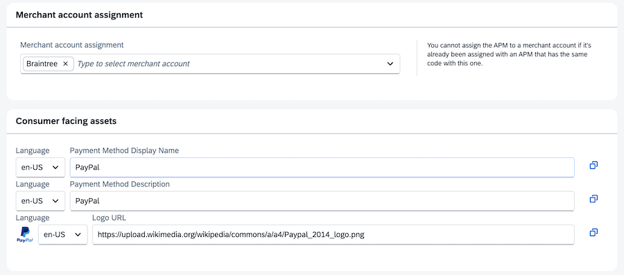 

### Braintree Setup

#### PayPay Developer Account
The Braintree documentation refers to setting up a PayPal Business account, but to test you can actually just signup for a PayPal Developer account [here](https://www.paypal.com/signin/client?flow=provisionUser&country.x=US&locale.x=en_US)

You will gain access to the [dashboard](https://developer.paypal.com/dashboard)

The Braintree setup will need you to create a Rest Application client and secret for Braintree to access PayPal [here](https://developer.paypal.com/dashboard/applications/sandbox)

We have found the default Application doesnt appear to work, so create a new Rest App.
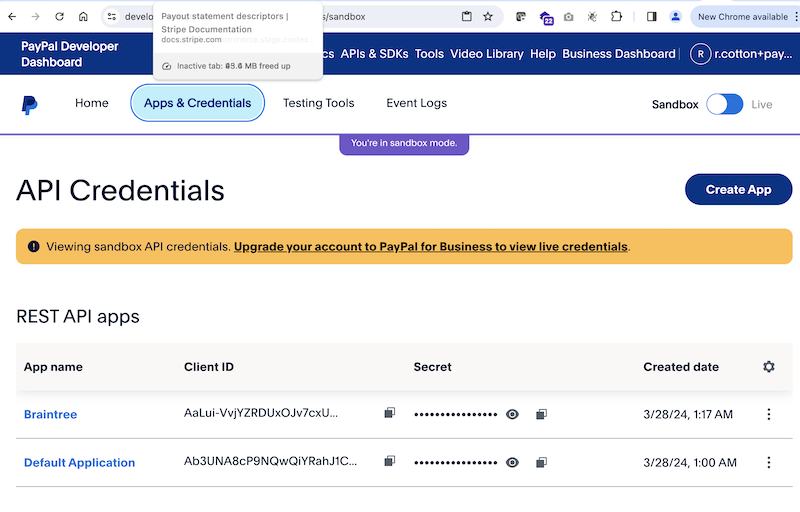

#### Braintree Instructions
[This guide](https://developer.paypal.com/braintree/articles/guides/payment-methods/paypal/setup-guide) describes the full setup process, but an abridged version for testing is as follows:

- Settings -> Processing -> Enable PayPal as a Payment Option
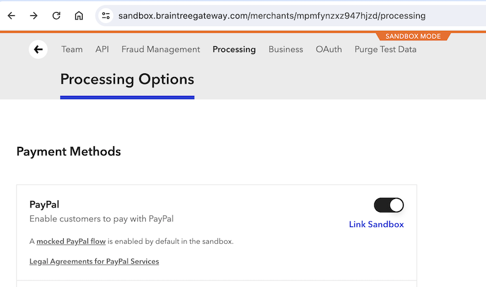
- Enter the email you registered your paypal developer account and the the Paypal Rest Application client and secret
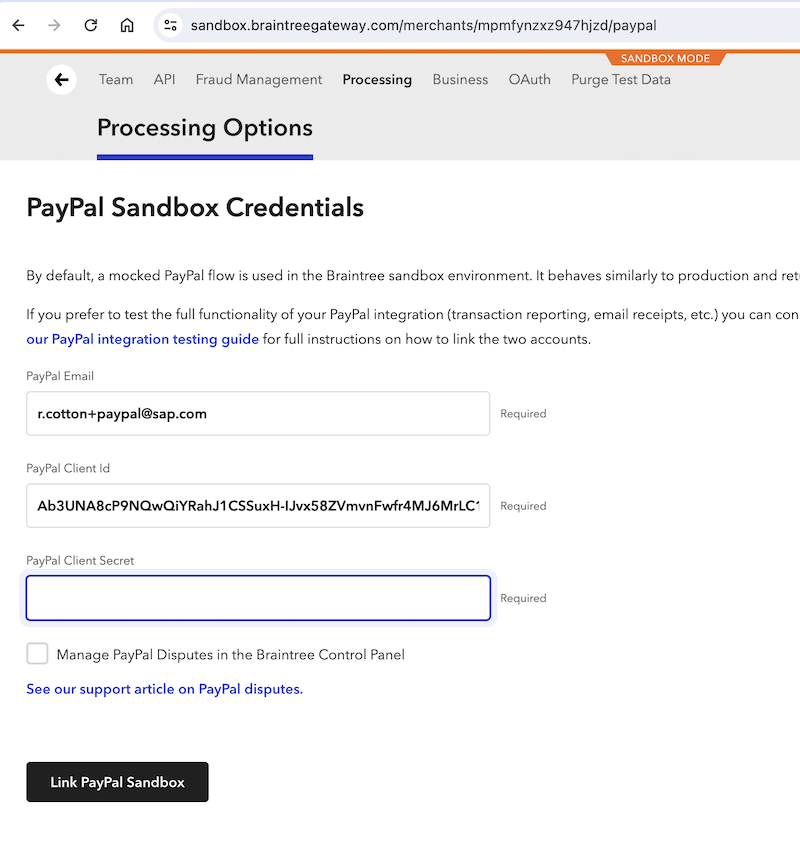

A PayPal payment option should be visible now in the Checkout Form.
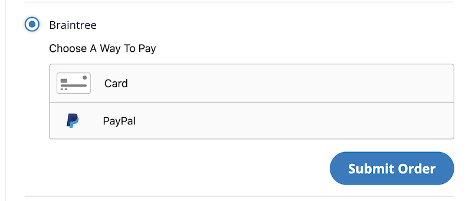

You can use [Sandbox Accounts](https://developer.paypal.com/dashboard/accounts) for testing.

