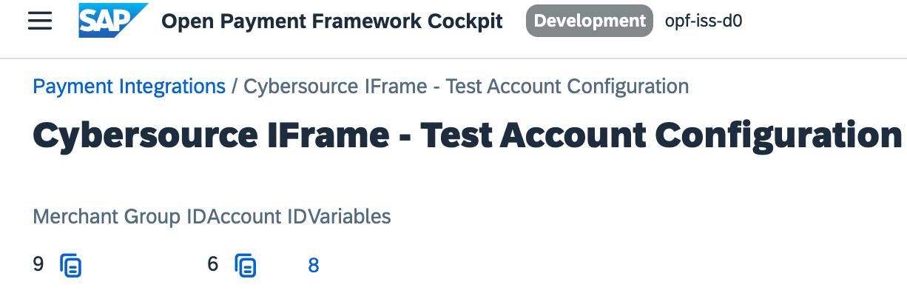

## Introduction ##
The Postman Collection enables Cybersource to be used to take payments through OPF. 

The integration supports:

* Authorization of Cybersource Payments using the OPF "iFrame" UX Pattern
* Deferred Capture support
* Refunds
* Reauthorization of saved payment

In summary: to import the [Cybersource iFrame Postman Collection](https://github.com/opf-postman/commerce-cloud-open-payment-integration/blob/main/postman/cybersource/iFrame/Cybersource%20-%20iFrame%20-%20CAPTURE_PER_SHIPMENT%20-%20OPF_Provider_Configuration.json) this page will guide you through the following steps: 

a) Create Your Cybersource Test Account.

b) Create an Cybersource payment integration in OPF Workbench.

c) Set up Your Cybersource Test Account to work with OPF.

d) Prepare the [Postman Environment](https://github.com/opf-postman/commerce-cloud-open-payment-integration/blob/main/postman/cybersource/iFrame/Cybersource%20-%20iFrame%20-%20CAPTURE_PER_SHIPMENT%20-%20OPF_Environment_Configuration.json) file so the collection can be imported with all your OPF Tenant and Cybersource Test Account unique values. 

## Create a Cybersource Account ##
You can sign up for a free Cybersource Test Account at https://ebctest.cybersource.com/ebc2.

## Creating a Cybersource Payment Integration 
Ceate a Cybersource payment integration in the OPF Workbench. For detailed instructions, see [Creating Payment Integration
](https://help.sap.com/docs/SAP_COMMERCE_CLOUD_PUBLIC_CLOUD/0996ba68e5794b8ab51db8d25d4c9f8a/20a64f954df1425391757759011e7e6b.html?state=DRAFT).

## Set up Your Cybersource Test Account to work with OPF
This includes **Configuring Payment Method**, **Configuring Checkout**, **Configuring Merchant Notifications**, **Configuring a Cybersource Hosted Response Page**, and **Activating a Profile**. For detailed instructions, see [Secure Acceptance Hosted Checkout
Integration](https://developer.cybersource.com/library/documentation/dev_guides/Secure_Acceptance_Hosted_Checkout/html/index.html#t=Topics%2FSecurity_Keys.htm%23TOC_Creating_Security_Keysbc-1&rhtocid=_4_2_0).

## Preparing the Postman environment_configuration file

**1. Token**

Get your access token using the auth endpoint https://{{authendpoint}}/oauth2/token and client ID and secret obtained from BTP Cockpit.

Copy the value of the access_token field (it’s a JWT) and set as the ``token`` value in the environment file.

**IMPORTANT**: Ensure the value is prefixed with **Bearer**. e.g. ``Bearer {{token}}``.

**2. Root url**

The ``rootUrl`` is the **BASE URL** of your OPF tenant.

E.g. if your workbench/OPF cockpit url was this …

<https://opf-iss-d0.uis.commerce.stage.context.cloud.sap/opf-workbench>.

The base Url would be

https://opf-iss-d0.uis.commerce.stage.context.cloud.sap.

**3. Integration ID and Configuration ID**

The ``integrationId`` and ``configurationId`` values identify the payment integration, which can be found in the top left of your configuration details page.

**4. merchantId** 

You can obtain your merchant ID in the Cybersource Dashboard.

**5. secretKey** and **accessKey**

The secretKey can be obtained here in the Cybersource dashboard. 
For detailed instructions, see [Secure Acceptance Hosted Checkout
Integration](https://developer.cybersource.com/library/documentation/dev_guides/Secure_Acceptance_Hosted_Checkout/html/index.html#t=Topics%2FSecurity_Keys.htm%23TOC_Creating_Security_Keysbc-1&rhtocid=_4_2_0). 

**6.profileId**

In the left navigation panel of Cybersource dashboard, choose **Payment Configuration**-> **Secure Acceptance Settings** to create a Hosted Checkout Profile.
Click the created profile name to view the profile details.

**7.apiKeyId** and **apiKeyValue**

In the left navigation panel, choose **Payment Configuration** -> **Key Management**.

a) Click **Generate Key**.

b) Select **REST Shared Secret**.

c) Copy the generated key to your clipboard by clicking the **clipboard** icon, or click **Download key** to download the shared secret.

d) Under the **Key Management** page, select **REST Shared Secret** from the filter to locate the newly created API Key and copy the Key ID and value.

**Summary**

The envirionment file is now ready for importing into Postman together with the Mapping Configuration Collection file. Ensure you select the correct environment before running the collection.

In summary, you should have edited the following variables: 

- **token** (https://github.com/opf-postman/commerce-cloud-open-payment-integration/blob/main/postman/cybersource/iFrame/Cybersource%20-%20iFrame%20-%20CAPTURE_PER_SHIPMENT%20-%20OPF_Environment_Configuration.json#L6)
- **rootUrl** (https://github.com/opf-postman/commerce-cloud-open-payment-integration/blob/main/postman/cybersource/iFrame/Cybersource%20-%20iFrame%20-%20CAPTURE_PER_SHIPMENT%20-%20OPF_Environment_Configuration.json#L11)
- **accountGroupId** (https://github.com/opf-postman/commerce-cloud-open-payment-integration/blob/main/postman/cybersource/iFrame/Cybersource%20-%20iFrame%20-%20CAPTURE_PER_SHIPMENT%20-%20OPF_Environment_Configuration.json#L21)
- **accountId** (https://github.com/opf-postman/commerce-cloud-open-payment-integration/blob/main/postman/cybersource/iFrame/Cybersource%20-%20iFrame%20-%20CAPTURE_PER_SHIPMENT%20-%20OPF_Environment_Configuration.json#L26)
- **merchantId** (https://github.com/opf-postman/commerce-cloud-open-payment-integration/blob/main/postman/cybersource/iFrame/Cybersource%20-%20iFrame%20-%20CAPTURE_PER_SHIPMENT%20-%20OPF_Environment_Configuration.json#L73)
- **secretKey** (https://github.com/opf-postman/commerce-cloud-open-payment-integration/blob/main/postman/cybersource/iFrame/Cybersource%20-%20iFrame%20-%20CAPTURE_PER_SHIPMENT%20-%20OPF_Environment_Configuration.json#L103)
- **accessKey** (https://github.com/opf-postman/commerce-cloud-open-payment-integration/blob/main/postman/cybersource/iFrame/Cybersource%20-%20iFrame%20-%20CAPTURE_PER_SHIPMENT%20-%20OPF_Environment_Configuration.json#L91)
- **profileId** (https://github.com/opf-postman/commerce-cloud-open-payment-integration/blob/main/postman/cybersource/iFrame/Cybersource%20-%20iFrame%20-%20CAPTURE_PER_SHIPMENT%20-%20OPF_Environment_Configuration.json#L85)
- **apiKeyId** (https://github.com/opf-postman/commerce-cloud-open-payment-integration/blob/main/postman/cybersource/iFrame/Cybersource%20-%20iFrame%20-%20CAPTURE_PER_SHIPMENT%20-%20OPF_Environment_Configuration.json//#L79)
- **apiKeyValue** (https://github.com/opf-postman/commerce-cloud-open-payment-integration/blob/main/postman/cybersource/iFrame/Cybersource%20-%20iFrame%20-%20CAPTURE_PER_SHIPMENT%20-%20OPF_Environment_Configuration.json#L97)
