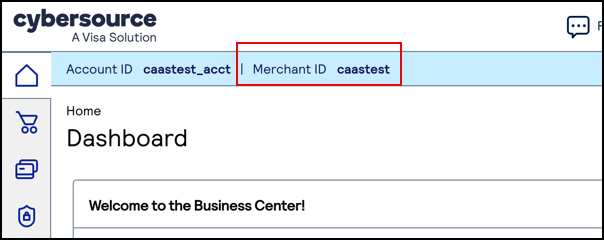
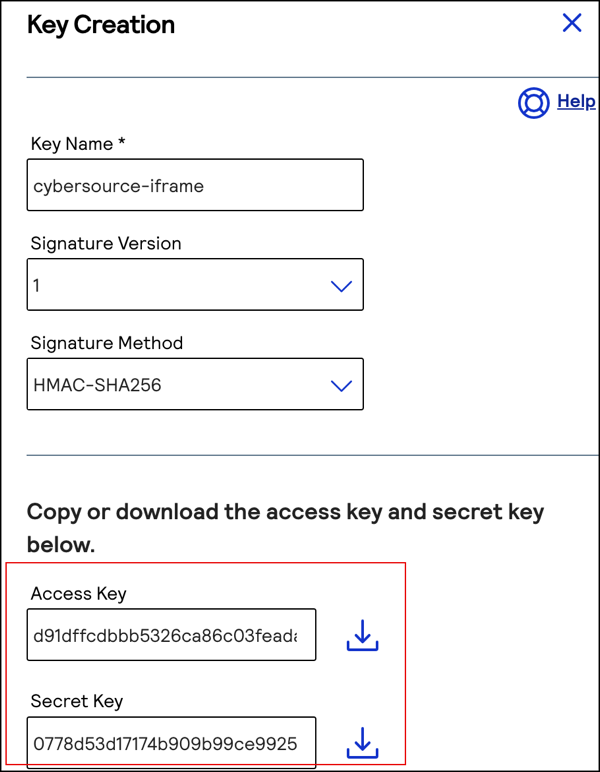
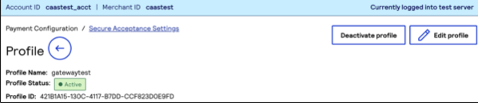
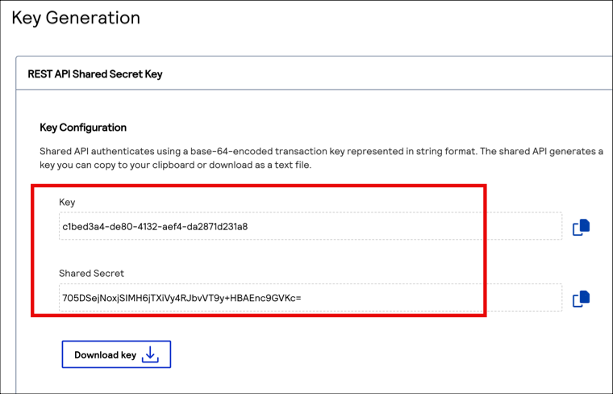

## Introduction ##
The Postman Collection enables Cybersource to be used to take payments through OPF. 

The integration supports:

* Authorization of Cybersource payments using the OPF "iFrame" UX pattern
* Deferred Capture support
* Refunds
* Reauthorization of saved payment

In summary: to import the [Cybersource iFrame Postman Collection](https://github.com/opf-postman/commerce-cloud-open-payment-integration/blob/main/postman/cybersource/iFrame/Cybersource%20-%20iFrame%20-%20CAPTURE_PER_SHIPMENT%20-%20OPF_Provider_Configuration.json) this page will guide you through the following steps: 

a) Create your Cybersource test account.

b) Create a Cybersource payment integration in OPF workbench.

c) Set up your Cybersource test account to work with OPF.

d) Prepare the [Postman Environment](https://github.com/opf-postman/commerce-cloud-open-payment-integration/blob/main/postman/cybersource/iFrame/Cybersource%20-%20iFrame%20-%20CAPTURE_PER_SHIPMENT%20-%20OPF_Environment_Configuration.json) file so the collection can be imported with all your OPF tenant and Cybersource test account unique values. 

## Creating a Cybersource Account ##
You can sign up for a free Cybersource test account at https://ebctest.cybersource.com/ebc2.

## Creating a Cybersource Payment Integration 
Create a Cybersource payment integration in the OPF Workbench. For reference, see [Creating Payment Integration
](https://help.sap.com/docs/SAP_COMMERCE_CLOUD_PUBLIC_CLOUD/0996ba68e5794b8ab51db8d25d4c9f8a/20a64f954df1425391757759011e7e6b.html?state=DRAFT).

## Setting up Your Cybersource Test Account to work with OPF
This includes **Configuring Payment Method**, **Configuring Checkout**, **Configuring Merchant Notifications**, **Configuring a Cybersource Hosted Response Page**, and **Activating a Profile**. For detailed instructions, see [Secure Acceptance Hosted Checkout
Integration](https://developer.cybersource.com/library/documentation/dev_guides/Secure_Acceptance_Hosted_Checkout/html/index.html#t=Topics%2FSecurity_Keys.htm%23TOC_Creating_Security_Keysbc-1&rhtocid=_4_2_0).

## Preparing the Postman environment_configuration file

**1. Token**

Get your access token using the auth endpoint https://{{authendpoint}}/oauth2/token and client ID and secret obtained from BTP Cockpit.

Copy the value of the access_token field (it’s a JWT) and set as the ``token`` value in the environment file.

**IMPORTANT**: Ensure the value is prefixed with **Bearer**. e.g. ``Bearer {{token}}``.

**2. Root url**

The ``rootUrl`` is the **BASE URL** of your OPF tenant.

E.g. if your workbench/OPF cockpit url was this …

<https://opf-iss-d0.uis.commerce.stage.context.cloud.sap/opf-workbench>.

The base Url would be

https://opf-iss-d0.uis.commerce.stage.context.cloud.sap.

**3. Integration ID and Configuration ID**

The ``integrationId`` and ``configurationId`` values identify the payment integration, which can be found in the top left of your configuration details page.

**4. merchantId** 

You can obtain your merchant ID in the Cybersource Dashboard.

**5. secretKey** and **accessKey**

The secretKey can be obtained here in the Cybersource dashboard. 
For detailed instructions, see [Secure Acceptance Hosted Checkout
Integration](https://developer.cybersource.com/library/documentation/dev_guides/Secure_Acceptance_Hosted_Checkout/html/index.html#t=Topics%2FSecurity_Keys.htm%23TOC_Creating_Security_Keysbc-1&rhtocid=_4_2_0). 

**6.profileId**

In the left navigation panel of Cybersource dashboard, choose **Payment Configuration**-> **Secure Acceptance Settings** to create a Hosted Checkout Profile.
Click the created profile name to view the profile details.

**7.apiKeyId** and **apiKeyValue**

In the left navigation panel, choose **Payment Configuration** -> **Key Management**.

a) Click **Generate Key**.

b) Select **REST Shared Secret**.

c) Copy the generated key to your clipboard by clicking the **clipboard** icon, or click **Download key** to download the shared secret.

d) Under the **Key Management** page, select **REST Shared Secret** from the filter to locate the newly created API Key and copy the Key ID and value.

## Allowlist 
Depending on your environment, add the following domains to the domain allowlist in OPF workbench. For instructions, see [Adding Tenant-specific Domain to Allowlist
](https://help.sap.com/docs/SAP_COMMERCE_CLOUD_PUBLIC_CLOUD/0996ba68e5794b8ab51db8d25d4c9f8a/a6836485b4494cfaad4033b4ee7a9c64.html?state=DRAFT).

``cybersource.com``
``apitest.cybersource.com``
``api.cybersource.com``

## Editing and Running the Postman Collection in the Postman App

   1. Import the two files at the same time to Postman.

   2. Make sure to select the environment for Cybersource.

   3. Edit the Postman environment file so the collection can be imported with all your OPF Tenant and Cybersouce Test Account unique values.
      
   4. Save and run the Postman collection.

      
## Validating the configuration in Open Payment Framework Workbench

   1. Log in to the open payment framework workbench.
   2. Click **Payment Integrations** in the left navigation bar.
   3. Navigate to **Payment Integrations** -> **(your Cybersource integration)** -> **Integration Details**.
   4. In the **Configuration section**, click **Show Details** to go to the configuration details page.
   5. In the **Settlement Method** section, make sure the right option is populated depending on your integration.
   6. In the **Authorization** section, click **Edit** to go to the authorization details page.
   7. In **Authorization** -> **Front-end component configuration**, make sure the Payment Form is the one corresponding to your integration.
