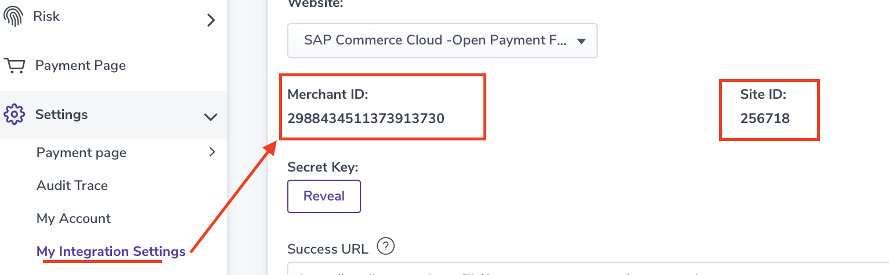

## Introduction ##
This Postman Collection aids in integrating [Nuvei](https://docs.nuvei.com/documentation/home/) into the Open Payment Framework (OPF).

The integration supports:

* Authorize card using Hosted Filed
* Settlement
* Refund
* Reversal
* Reauthorization

### In summary ###
In summary, to import the [Postman Collection](mapping_configuration.json), this page will guide you through the following steps:

a) Create your Nuvei test account.

b) Create a Nuvei payment integration in OPF.

c) Get the credentials for your Nuvei integration.

d) Prepare the [Postman Environment](environment_configuration.json) file so the collection can be imported with all your OPF Tenant and Nuvei Test Account unique values. 

### Creating a Nuvei Account ###
Create your Nuvei test account by writing mail to: integration-international@nuvei.com

### Creating a Nuvei Payment Integration ###
Create a Nuvei payment integration in the OPF workbench. For reference, see [Creating Payment Integration
](https://help.sap.com/docs/SAP_COMMERCE_CLOUD_PUBLIC_CLOUD/0996ba68e5794b8ab51db8d25d4c9f8a/20a64f954df1425391757759011e7e6b.html?state=DRAFT).

### Get the credentials for your Nuvei integration ###

You will find the credentials after logging in [Nuvei test account](https://sandbox.nuvei.com/)
The MerchantID siteID and secret Key are under Settings -> My Integrations Settings.

### Preparing the Postman environment_configuration file ###

**1. Token**

Get your access token by [creating an external app](https://help.sap.com/docs/SAP_COMMERCE_CLOUD_PUBLIC_CLOUD/0996ba68e5794b8ab51db8d25d4c9f8a/d927d21974fe4b368e063f72733bf0fe.html?state=DRAFT) and [making authorized API calls](https://help.sap.com/docs/SAP_COMMERCE_CLOUD_PUBLIC_CLOUD/0996ba68e5794b8ab51db8d25d4c9f8a/40c792e66e2942209dc853a43533d78d.html?state=DRAFT).

Copy the value of the access_token field (it’s a JWT) and set as the ``token`` value in the environment file.

**IMPORTANT**: Ensure the value is prefixed with **Bearer**. e.g. ``Bearer {{token}}``.

**2. Root url**

The ``rootUrl`` is the **BASE URL** of your OPF tenant.

E.g. if your workbench/OPF cockpit url was this …

<https://opf-iss-d0.uis.commerce.stage.context.cloud.sap/opf-workbench>.

The base Url would be

https://opf-iss-d0.uis.commerce.stage.context.cloud.sap.

**3. Integration ID and Configuration ID**

The ``integrationId`` and ``configurationId`` values identify the payment integration and payment configuration, which can be found in the top left of your **Configuration Details** page in the OPF workbench.

* ``integrationId`` maps to ``accountGroupId`` in postman
* ``configurationId`` maps to ``accountId`` in postman

**4. merchantID and siteID**

You already gets those IDs from the Nuvei backoffice.(under Settings -> My Integrations Settings.)

**5. secretKey**

Same place that you find the merchantId, you need click the "Reveal" button to get the secret Key.

**6. apiEnv**

``secure.safecharge.com`` for production script element

``ppp-test.nuvei.com`` for sandbox script element

### Allowlist
Add the following domains to the domain allowlist in OPF workbench. For instructions, see [Adding Tenant-specific Domain to Allowlist
](https://help.sap.com/docs/SAP_COMMERCE_CLOUD_PUBLIC_CLOUD/0996ba68e5794b8ab51db8d25d4c9f8a/a6836485b4494cfaad4033b4ee7a9c64.html?state=DRAFT).

``safecharge.com`` for production account

``nuvei.com``and ``safecharge.com`` for test account

### Summary

The envirionment file is now ready for importing into Postman together with the Mapping Configuration Collection file. Ensure you select the correct environment before running the collection.

In summary, you should have edited the following variables: 

#### Common
- ``token``
- ``rootUrl``
- ``accountGroupId``
- ``accountId`` 

#### BlueSnap Specific
- ``merchantID``
- ``siteID``
- ``secretKey``
  
